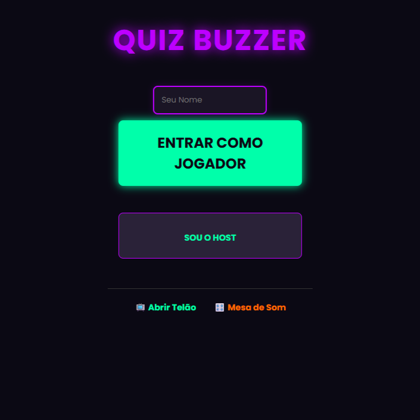

# 🕹️ Quiz Buzzer (WebSockets)

Um sistema completo de Quiz Buzzer (botões de resposta) para eventos locais, rodando direto no navegador dos smartphones dos participantes. Desenvolvido com Python, Flask e WebSockets para garantir tempo de resposta em milissegundos.

## ✨ Funcionalidades

* **Tempo Real:** Comunicação via WebSocket, registrando quem apertou primeiro na mesma fração de segundo.
* **Travamento Anti-Cheating:** O primeiro clique trava a tela de todos os outros participantes.
* **Painel do Host:** Controle total da partida. Libere os botões, resete a rodada e ajuste o placar manualmente de um computador ou celular mestre.
* **Telão (Display):** Uma tela dedicada para TVs/Projetores com Placar Geral e um **QR Code dinâmico** para os convidados entrarem sem digitar IPs.
* **Soundboard Automática:** Tela dedicada para o DJ/Host disparar efeitos sonoros. Basta soltar arquivos `.mp3` na pasta que os botões são gerados sozinhos!
* **Mobile First (e Blindado):** A tela dos jogadores foi desenhada para impedir comportamento padrão do celular (como zoom ao dar cliques duplos ou elástico de rolagem na tela), garantindo que o botão não falhe na hora da adrenalina.
* **Tema Dark/Neon:** Visual moderno de Game Show.

## 🛠️ Tecnologias Utilizadas

* **Backend:** Python 3, Flask, Flask-SocketIO.
* **Frontend:** HTML5, CSS3, Vanilla JavaScript, Socket.IO Client.
* **Outros:** QRCode.js (Geração de QR Code via Client-side).

## 📁 Estrutura do Projeto

```text
quiz-buzzer/
├── app.py                   # Servidor Principal
├── requirements.txt         # Dependências do Python
├── static/                  # Arquivos estáticos
│   ├── style.css            # Estilos (Tema Neon)
│   └── sounds/              # Coloque seus arquivos .mp3 aqui
└── templates/               # Telas do Jogo
    ├── index.html           # Tela inicial/Login
    ├── host.html            # Painel de controle
    ├── player.html          # Botão do participante
    ├── display.html         # Telão (Placar + QR Code)
    └── soundboard.html      # Mesa de efeitos sonoros
